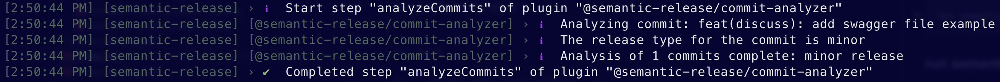
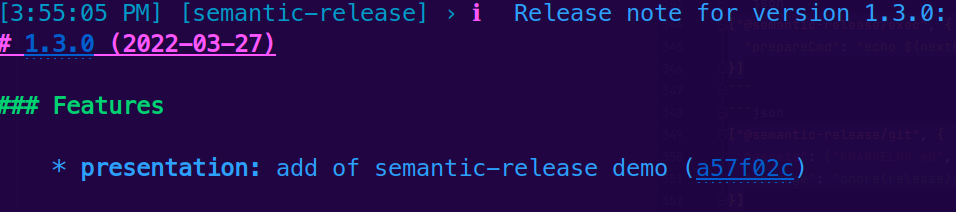

# Semantic Version

Note: authors : 
 - s. Lavazais
 - d. Six

sources:
- https://en.wikipedia.org/wiki/Dependency_hell
- https://semver.org/
- https://github.com/semantic-release/semantic-release

<!--h-->

## Summary

```text
version 1.2.3
        ^ ^ ^
        ║ ║ ╚═ Patch : backward compatible bug fixes
        ║ ╚═══ Minor : features backward compatible manner
        ╚═════ Major : breaking changes API
```

Note: Semantic version is the set of rules dictating how version numbers of an API are assigned 
and incremented. Based on but not limited to common practices of closed and open source software development.

Consider a version like `X.Y.Z` where `X` is `MAJOR` number, `Y` is `MINOR` number 
and `Z` is `PATCH` number.

 - Bug fixes represent the `PATCH` number with obvious backward compatibility.
 - Addition/changes with backward compatibility increment the `MINOR` number.
 - and any other changes with backward incompatibility increment the `MAJOR` number.
 
<!--v-->

### dependency hell

```text [|4,7,10|2,5,8]
my-app 4.7.2
╠═ internal lib 5.6.1
║  ╚═ logger lib 2016.3.4
║     ╚═ another external lib 0.3.0
╠═ database lib 12(cookie)
║  ╚═ io lib 3.0.0
║     ╚═ another external lib 0.3.0
╠═ list lib 0.1.2alpha
║  ╚═ external lib 4.8
║     ╚═ another external lib 0.3.0
```

Note: When version numbers are not standardized, solving a simple issue of a common dependency can 
be a real nightmare, since there is no common way to increment version of dependents libs

<!--h-->

## Set of rules

Note: here are the set of rules defines in [specifications](https://semver.org/#semantic-versioning-specification-semver)

<!--v-->

### public API

only after the release of version 1.0.0

Note: any application/lib must declare a public API (it could be simple documentation). It must be only define after the first major version.

- [rule #1](https://semver.org/#spec-item-1)
- [rule #5](https://semver.org/#spec-item-5)

<!--v-->

### X.Y.Z form

```text
1.2.3
^ ^ ^
║ ║ ╚═ Patch
║ ╚═══ Minor
╚═════ Major
```

Note: a normal version must be formatted with 3 non-negative integer separated by dot.

each integer represent a different type of modification of the application/lib imply.

- [rule #2](https://semver.org/#spec-item-2)

<!--v-->

<!-- .slide: data-auto-animate -->
### pre-release rules

init dev start with `"v0"`

```text
0.x.x
```

Note: initial development start at version 0.x.x, the increment of the version a this state can occur 
any time and the version is not stable.

- [rule #4](https://semver.org/#spec-item-4)

<!--v-->

<!-- .slide: data-auto-animate -->
### pre-release rules

can add `"-"` and other identifiers separated by `"."`

```text
1.1.2-alpha.1
1.1.2-5.7.9
```


Note: pre-released version can be defined by adding identifiers after the patch integer lead by a hyphen.

then each identifier must be separated by a dot.

- [rule #9](https://semver.org/#spec-item-9)

<!--v-->

### build metadata

can add `"+"` and other identifiers separated by `"."`

```text
1.1.2+012
1.1.2+21AF26D3
1.1.2-beta+exp.sha.749f34
```

Note: versions for build metadata should be separated from the rest of the version by adding a plus sign

- [rule #10](https://semver.org/#spec-item-10)

<!--v-->

<!-- .slide: data-auto-animate -->
### increment rules

any modification after first release is a new version

```text
1.2.3
```

Note: any modification after the first release must imply a modification of the version

- [rule #3](https://semver.org/#spec-item-3)

<!--v-->

<!-- .slide: data-auto-animate -->
### increment rules

Patch version

bug fixes (backward compatible)

```text
1.2.3
```

Note: go to the next slide for notes

<!--v-->

<!-- .slide: data-auto-animate -->
### increment rules

Patch version

bug fixes (backward compatible)

```text
1.2.4
```

Note: bug fixes should increment the patch version

- [rule #6](https://semver.org/#spec-item-6)

<!--v-->

<!-- .slide: data-auto-animate -->
### increment rules

Minor version

new features (backward compatible)

```text
1.2.4
```

Note: go to the next slide for notes

<!--v-->

<!-- .slide: data-auto-animate -->
### increment rules

Minor version

new features (backward compatible)

```text
1.3.0
```

Note: adding a new features should increment the minor version, only if these modifications has not
broken the backward compatibility of the application/lib

this incrementation imply that the patch version is reset to 0

- [rule #7](https://semver.org/#spec-item-7)

<!--v-->

<!-- .slide: data-auto-animate -->
### increment rules

Major version

any backward incompatible changes

```text
1.3.0
```

Note: go to the next slide for notes

<!--v-->

<!-- .slide: data-auto-animate -->
### increment rules

Major version

any backward incompatible changes

```text
2.0.0
```

Note: any breaking changes (that broke the backward compatibility) should increment the major version,

this incrementation imply that the patch and the minor versions are reset to 0

- [rule #8](https://semver.org/#spec-item-8)

<!--v-->

<!-- .slide: data-auto-animate -->
### precedence rules

```text
1.0.0 < 2.0.0 < 2.1.0 < 2.1.1
```

Note: the precedences rules define how versions are compared to each other 

the precedence must be calculated by separating the version into major, minor, patch 
and pre-release identifiers in that order (Build metadata does not figure into precedence).

- [rule #11](https://semver.org/#spec-item-11)

<!--v-->

<!-- .slide: data-auto-animate -->
### precedence rules

with pre-release

```text
1.0.0-alpha < 1.0.0
```

Note: pre-released version has lower precedence compared to normal version

- [rule #11](https://semver.org/#spec-item-11)

<!--v-->

<!-- .slide: data-auto-animate -->
### precedence rules

with pre-release

```text
1.0.0-alpha < 1.0.0-alpha.1 < 1.0.0-alpha.beta < 1.0.0-beta
1.0.0-beta.2 < 1.0.0-beta.11 < 1.0.0-rc.1 < 1.0.0
```

Note: precedence of pre-released versions of same core version must determine by comparing each 
dot separated identifier from left to right until a difference is found.

- [rule #11](https://semver.org/#spec-item-11)

<!--h-->

## Using semantic-release

📦🚀 semantic-release

```text
verb(scope): message

notes
```
```text
fix(security): fix security check
```
```text
feat(security): add security standard
```
```text
feat(security): new security standard

BREAKING CHANGES: don't support old security standard
```

Note: Semantic Versioning can be easily implemented to any project by using tools like semantic-release

semantic-release parse commit messages to build a version number. by default this tool will build the first
release if no tag of version exist (1.0.0)

<!--v-->

### config semantic-release

```json[|2|3|4-11|6,9]
{
  "branches": ["main"],
  "tagFormat": "${version}",
  "plugins": [
    "@semantic-release/commit-analyzer",
    "@semantic-release/exec",
    "@semantic-release/release-notes-generator",
    "@semantic-release/changelog",
    "@semantic-release/git",
    "@semantic-release/github"
  ]
}
```

<!--v-->

### config semantic-release

```json
["@semantic-release/exec", {
  "prepareCmd": "echo ${nextRelease.version} > version.txt"
}]
```
```json
["@semantic-release/git", {
  "assets": ["CHANGELOG.md", "version.txt"],
  "message": "chore(release): version ${nextRelease.version}"
}]
```

<!--v-->

<!-- .slide: data-auto-animate -->
### run semantic-release

```shell
npx semantic-release
```

<!--v-->

<!-- .slide: data-auto-animate -->
### run semantic-release




<!--h-->

## Thank you

Authors: 
#### s. Lavazais
#### d. Six

Sources:
#### https://en.wikipedia.org/wiki/Dependency_hell
#### https://semver.org/
#### https://github.com/semantic-release/semantic-release
#### [https://github.com/angular/master/CONTRIBUTING.md](https://github.com/angular/angular/blob/master/CONTRIBUTING.md#-commit-message-format)
